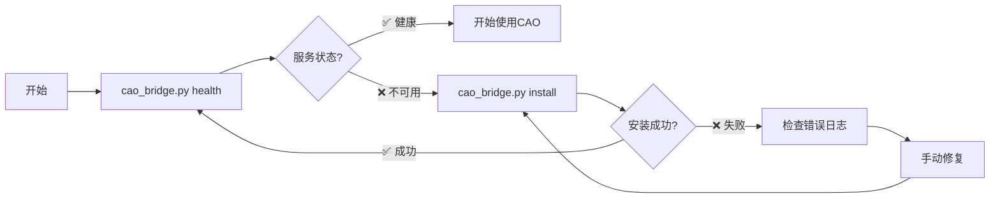

# CAO (CLI Agent Orchestrator) 技能

[](https://opensource.org/licenses/MIT)
[](https://python.org)
[](https://claude.ai/code)

CAO (CLI Agent Orchestrator) 是一个强大的Agent编排系统，专为 Claude Code 设计。通过本技能，您可以管理多个AI Agent执行复杂的开发任务，实现多Agent协作、任务分配、进度监控和结果收集。

## 🚀 特性

- ✅ **智能Agent编排**: 支持 developer、code-reviewer、researcher 等多种Agent类型
- ✅ **分离式命令设计**: 健康检查和安装完全分离，用户完全控制
- ✅ **自动安装**: 使用 uvx 自动安装和配置CAO服务
- ✅ **多Provider支持**: droid、claude_code、codex、q_cli、kiro_cli
- ✅ **实时监控**: 任务执行状态监控和进度跟踪
- ✅ **Inbox消息**: Agent间通信和状态同步
- ✅ **零配置**: 开箱即用的使用体验
- ✅ **完整工作流**: 从任务规划到结果集成的完整解决方案

## 📦 安装

### 方式一：Claude Code 技能市场（推荐）

1. 在 Claude Code 中打开技能管理器
2. 搜索 "CAO" 或 "CLI Agent Orchestrator"
3. 点击安装

### 方式二：手动安装

```bash
# 克隆技能到 Claude Code 技能目录
git clone git@github.com:yubing744/cao-skill.git ~/.claude/skills/cao
```

## 🎯 快速开始

### 基本使用
```bash
# 进入技能目录
cd ~/.claude/skills/cao

# 检查CAO服务状态
python3 scripts/cao_bridge.py health

# 安装CAO服务（如果需要）
python3 scripts/cao_bridge.py install

# 分配任务给Agent
python3 scripts/cao_bridge.py assign developer "请分析当前项目代码质量"
```

### 环境要求
- Python 3.9+
- requests 库
- uvx (用于自动安装)

### 环境检查
```bash
cd ~/.claude/skills/cao

python3 --version
python3 -c "import requests; print('requests OK')"
uvx --version
python3 scripts/cao_bridge.py --help
```

## 📋 核心功能

### 1. Agent Types

| Agent Type | 适用场景 | 技能特点 |
|-----------|---------|---------|
| `developer` | 代码开发、bug修复、功能实现 | GitHub CLI、多语言编程、调试测试 |
| `code-reviewer` | PR审查、代码质量分析、安全检查 | 深度代码分析、架构评估、最佳实践验证 |
| `researcher` | 技术调研、文档分析、竞品研究 | 文献检索、数据分析、报告生成 |

### 2. 任务管理

#### 标准任务模板
```
🎯 任务：[具体任务名称]

📋 执行要求：
1. [具体步骤1]
2. [具体步骤2]
3. [具体步骤3]

📊 输出格式：
[期望的输出格式]

⏰ 预期时间：[预计完成时间]
🎯 成功标准：[明确的完成标准]
```

### 3. 分离式命令

```bash
# 仅检查服务状态
python3 scripts/cao_bridge.py health

# 安装CAO服务
python3 scripts/cao_bridge.py install

# 推荐工作流
python3 scripts/cao_bridge.py health        # 检查状态
python3 scripts/cao_bridge.py install       # 如需要则安装
python3 scripts/cao_bridge.py health        # 再次验证
```

## 🔄 工作流程图



## 📚 使用示例

### 开发任务
```bash
python3 scripts/cao_bridge.py assign developer --timeout 3600 <<'EOF'
🎯 任务：实现用户登录功能

📋 执行要求：
1. 设计安全的用户认证系统
2. 实现JWT token管理
3. 添加登录表单验证
4. 创建用户注册功能

📊 输出格式：
=== 用户登录功能实现报告 ===
1. 实现概述
2. 文件结构
3. API接口
4. 前端组件
5. 测试结果

⏰ 预期时间：2小时
🎯 成功标准：用户可以安全登录和注册
EOF
```

### 代码审查
```bash
python3 scripts/cao_bridge.py assign code-reviewer --provider claude_code --timeout 1800 <<'EOF'
🎯 任务：审查PR #123

📋 审查重点：
1. 代码质量和可读性
2. 安全漏洞检查
3. 性能影响评估
4. 测试覆盖完整性
5. 向后兼容性验证

📊 输出格式：
=== PR #123 代码审查报告 ===
1. 总体评价
2. 具体问题和建议
3. 安全问题
4. 性能考虑
5. 审查结论
EOF
```

### 多Agent协作
```bash
# 1. researcher收集信息
python3 scripts/cao_bridge.py assign researcher --timeout 1200 <<'EOF'
🎯 任务：调研微服务架构最佳实践

📋 调研范围：
1. 微服务设计模式
2. 服务间通信方案
3. 数据一致性策略
4. 监控和日志方案

📊 输出格式：
=== 微服务架构调研报告 ===
1. 架构模式对比
2. 技术选型建议
3. 实施路径规划
4. 风险评估
EOF

# 2. developer基于调研结果实现
python3 scripts/cao_bridge.py assign developer --timeout 3600 <<'EOF'
🎯 任务：基于调研结果实现微服务架构

📋 实现要求：
1. 根据调研报告选择架构模式
2. 实现API网关
3. 配置服务发现
4. 添加分布式追踪

📊 输出格式：
=== 微服务架构实现报告 ===
1. 架构实现详情
2. 配置文件
3. 部署脚本
4. 测试结果
EOF

# 3. code-reviewer审查实现
python3 scripts/cao_bridge.py assign code-reviewer --timeout 1800 <<'EOF'
🎯 任务：审查微服务架构实现

📋 审查重点：
1. 架构设计合理性
2. 服务拆分正确性
3. 通信协议选择
4. 配置管理
5. 容错处理

📊 输出格式：
=== 微服务架构审查报告 ===
1. 架构评估
2. 问题识别
3. 改进建议
4. 部署建议
EOF
```

## 🔧 高级功能

### Provider选择策略

| Provider | 适用场景 | 特点 |
|---------|---------|------|
| `droid` | 通用开发任务 | 平衡性能和质量 |
| `claude_code` | 复杂推理架构设计 | 强大的代码分析能力 |
| `codex` | 代码生成重构 | 专门的代码生成工具 |
| `q_cli` | CLI工具系统管理 | 命令行专家 |
| `kiro_cli` | 系统部署DevOps | 运维自动化 |

### 自定义配置

```bash
# 使用特定Provider
python3 scripts/cao_bridge.py assign developer --provider claude_code "复杂推理任务"

# 设置超时时间
python3 scripts/cao_bridge.py assign researcher --timeout 7200 "深度研究任务"

# 自定义session名称
python3 scripts/cao_bridge.py assign developer --session-name "feature-x" "功能开发任务"
```

### 监控和管理

```bash
# 列出所有sessions
python3 scripts/cao_bridge.py list

# 监控特定terminal
python3 scripts/cao_bridge.py monitor <terminal_id>

# 获取terminal信息
python3 scripts/cao_bridge.py terminal <terminal_id>

# 获取输出
python3 scripts/cao_bridge.py output <terminal_id> --mode full
```

### Inbox消息系统

```bash
# 查看消息
python3 scripts/cao_bridge.py inbox-list <terminal_id>

# 发送消息
python3 scripts/cao_bridge.py inbox-send <receiver_id> <sender_id> "请补充更多细节"
```

## 🛠️ 故障排除

### 常见问题

#### 问题1：CAO服务不可用
```bash
python3 scripts/cao_bridge.py install
```

#### 问题2：命令找不到
```bash
# 确保在技能目录内
cd ~/.claude/skills/cao
pwd
python3 scripts/cao_bridge.py --help
```

#### 问题3：依赖缺失
```bash
pip3 install requests uvx
```

#### 问题4：权限问题
```bash
chmod +x scripts/cao_bridge.py
```

### 调试模式

```bash
# 检查服务状态
python3 scripts/cao_bridge.py health

# 查看详细错误信息
python3 scripts/cao_bridge.py list
```

## 📈 最佳实践

### 1. 任务设计原则
- **明确性**: 任务描述要具体、可执行
- **可测量**: 定义明确的成功标准
- **可分解**: 大任务分解为小步骤
- **时间限制**: 设置合理的超时时间

### 2. Agent选择策略
- **简单任务**: 优先使用developer
- **质量要求高**: 使用code-reviewer
- **研究分析**: 使用researcher
- **复杂任务**: 考虑多Agent协作

### 3. 使用建议
- 从简单任务开始熟悉技能
- 善用协作模式处理复杂任务
- 定期检查服务状态
- 合理设置超时时间
- 及时清理不用的sessions

## 🤝 贡献

欢迎提交Issue和Pull Request来改进CAO技能！

### 开发环境设置
```bash
git clone git@github.com:yubing744/cao-skill.git
cd cao-skill
python3 scripts/cao_bridge.py --help
```

### 测试
```bash
# 基本功能测试
python3 scripts/cao_bridge.py health

# 命令帮助测试
python3 scripts/cao_bridge.py --help
```

## 📄 许可证

本项目采用 MIT 许可证 - 详见 [LICENSE](LICENSE) 文件

## 🔗 相关链接

- [CAO 主仓库](https://github.com/awslabs/cli-agent-orchestrator)
- [Claude Code](https://claude.ai/code)
- [uvx 文档](https://github.com/astral-sh/uvx)
- [技能开发指南](https://github.com/anthropics/claude-code-docs)

---

**Made with ❤️ for Claude Code users**